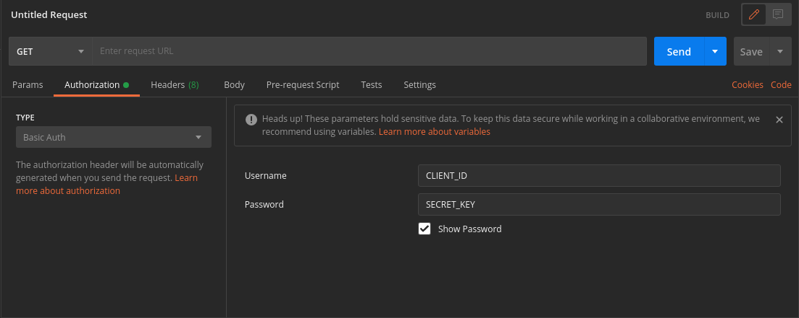

---

Authentication is done via [HTTP Basic Authentication](https://en.wikipedia.org/wiki/Basic_access_authentication). The username to be provided is the `client_id`, and the password is the `secret_key`.

## JavaScript

### Step 1

Combine Username and Password separated by `:` (colon).

If your

`client_id` is `c03b7c98b645622c14d399e4ed65b067ecb26aa4` and your

`secret_key` is `2716672358e43eb2b38ffbb787bd73bbb6b99e0402e4b4ad9d59d16a61538888`,

the result is:

```javascript
const auth =
  'c03b7c98b645622c14d399e4ed65b067ecb26aa4:2716672358e43eb2b38ffbb787bd73bbb6b99e0402e4b4ad9d59d16a61538888';
```

### Step 2

Apply Base64 encoding to Step 1's result. The Base64 encoded string will be:

```javascript
const encodedAuth = Buffer.from(auth).toString('base64');
// YzAzYjdjOThiNjQ1NjIyYzE0ZDM5OWU0ZWQ2NWIwNjdlY2IyNmFhNDoyNzE2NjcyMzU4ZTQzZWIyYjM4ZmZiYjc4N2JkNzNiYmI2Yjk5ZTA0MDJlNGI0YWQ5ZDU5ZDE2YTYxNTM4ODg4
```

### Step 3

Indicate the authorization method "Basic" followed by a space then the Base64 encoded string in Step 2.

```javascript
Authorization: `Basic ${encodedAuth}`;
```

## Axios

### Request Config

[Axios Request Config](https://www.npmjs.com/package/axios#request-config)

```json
{
  // `auth` indicates that HTTP Basic auth should be used, and supplies credentials.
  // This will set an `Authorization` header, overwriting any existing
  // `Authorization` custom headers you have set using `headers`.
  // Please note that only HTTP Basic auth is configurable through this parameter.
  // For Bearer tokens and such, use `Authorization` custom headers instead.
  "auth": {
    "username": "{CLIENT_ID}",
    "password": "{SECRET_KEY}"
  }
}
```

## Postman



If you are using Postman to test the API endpoints,

:::info IMPORTANT

Please remove the comments `"the grey text after //"` in the example request body before putting it into the postman request body.

:::
